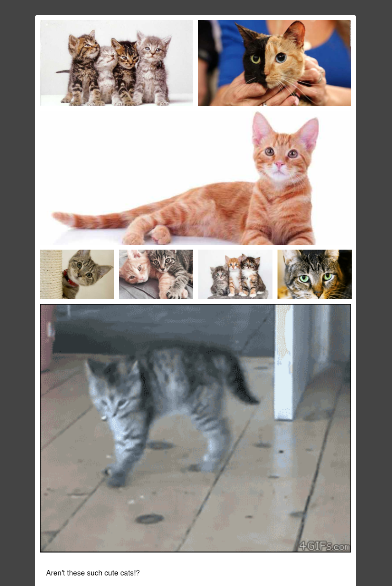

# gatsby-remark-tumble-media

A gatsby plugin to do tumble blog style media embeds, like photosets,
videos, and links.

## Usage

This is designed to work alongside `gatsby-remark-images`.  To use it,
first install it:

```
npm install gatsby-remark-tumble-media
```

and then add this in your `gatsby-config.js` file, in the `plugins`
section:

```js
// ...
plugins: [
  {
    resolve: `gatsby-source-filesystem`,
    options: {
      name: `src`,
      path: `${__dirname}/src/`,
    },
  },
  {
    resolve: `gatsby-transformer-remark`,
    options: {
      plugins: [
        {
          resolve:`gatsby-remark-tumble-media`,
          options: {
            // optional, defaults to 700
            // should be the same as whatever remark-images
            // is using below.
            maxWidth: 700,
          }
        },
        `gatsby-remark-copy-linked-files`,
        {
          resolve: `gatsby-remark-images`,
          options: {
            // make this be the same as the remark-tumble-media
            // value above
            maxWidth: 700,
            // don't let remark-images make the images too big
            // which breaks the responsive design stuff.
            wrapperStyle: 'max-width:100% !important;'
          }
        },
      ],
    },
  },
  // ... other plugins...
]
```

Then, in your markdown posts, you can put things in the yaml
frontmatter to create photosets and embeds.

### Photo Sets

A photoset is a 2-d array of images.  The first level of the array is
the rows, and the next is the columns in that row.  Images will be
automatically scaled down to fit in the space allotted, with a 10px
border between and around them.

Put the photos in the `photos:` field in your yaml.  Then put the
picture files themselves in the same folder as the markdown.

For example, this markdown post:

```markdown
---
date: 2018-12-29
photos:
  - - four-in-a-row.jpg
    - cat.jpg Alt text goes here
  - - cat-on-its-own-row.jpg    Separate with any number of whitespace
  - - one-kitten.jpg
    - two-kittens.jpg
    - three-kitties.jpg
    - cat.png
  - - >-
      moving-cat.gif If you have a very long alt text to write, you
      can always take advantage of yaml's various features for folded
      text like this. Quote characters like '"' will be escaped as
      '&quo;' appropriately, but it should all be a single line in the
      end.  It's probably not a great idea to have this much alt text
      on an img tag, of course.  Just showing that the plugin will let
      you do so.
---
Aren't these such cute cats!?
```

would produce a page something like this:



If you only have one image in the photoset, then it won't have the
white border.  It'll just be full-size.

If the viewport shrinks too small to fit the rows and columns, then
they'll responsive design CSS transform into a single column of
full-width images.

### Audio

To embed audio from a site like YouTube or wherever, just grab the
embed code, and put it in a `audio` field in the yaml.

Example:

```
---
title: Portishead meets Wu Tang - Blue Flowers
audio: >-
  <iframe width="100%" height="300" scrolling="no"
  frameborder="no" allow="autoplay"
  src="https://w.soundcloud.com/player/?url=https%3A//api.soundcloud.com/tracks/44509244&color=%23ff5500&auto_play=false&hide_related=false&show_comments=true&show_user=true&show_reposts=false&show_teaser=true&visual=true"></iframe>
---
Speaks for itself
```

### Videos

Just like audio, but with `video:` instead of `audio:`.

```
---
video: >-
  <iframe width="560" height="315"
  src="https://www.youtube.com/embed/dQw4w9WgXcQ" frameborder="0"
  allow="accelerometer; autoplay; encrypted-media; gyroscope;
  picture-in-picture" allowfullscreen></iframe>
title: Great new hit single
---
Check out this new video I just found!
```

You can also do local files with a `<video>` tag.  [Here's an
example.](https://github.com/isaacs/blog.izs.me/tree/master/src/pages/2014/04/adaytoromana-this-kinda-makes-me-uncomfortable)

### YouTube Videos

To embed a YouTube video, put the YouTube url in the `youtube`
field in the markdown frontmatter.

```
---
youtube: https://www.youtube.com/watch?v=dQw4w9WgXcQ
title: Great new hit single
---
Check out this new video I just found!
```

### Vimeo Videos

To embed a Vimeo video, put the Vimeo url in the `vimeo` field in the
markdown frontmatter.

```
---
vimeo: https://vimeo.com/232554578
title: Tar Wars
---
It is a period of civil war...
```
